# 🛡️ Certificate Vault – Cloud-Native Digital Certificate Management System

[](#)
[](#)
[](#)
[](#)
[](#)
[](#)
[](#)

---

## 📌 Project Overview

**Certificate Vault** is a production-grade, cloud-native web application designed for students and professionals to securely upload, organize, manage, search, download, and access their digital credentials and certificates from anywhere at any time.

Unlike traditional web applications that store files locally on the server filesystem, Certificate Vault decouples storage and computation entirely. All uploaded certificate documents are stored securely in **Amazon S3** with private access configurations, while their structured metadata is indexed inside **Amazon DynamoDB**.

The application backend is engineered as a stateless service, allowing it to scale horizontally under heavy traffic demands. It is deployed on a highly resilient AWS infrastructure utilizing **Amazon EC2**, **Application Load Balancers (ALB)**, and **Auto Scaling Groups (ASG)**. This project highlights modern full-stack JavaScript development coupled with industry-standard AWS cloud architecture practices.

---

## ⚠️ Problem Statement

In the modern digital landscape, individuals compile numerous certificates from universities, online courses, bootcamps, and professional organizations. 

*   **Scattered storage:** Users store files across local hard drives, cloud drives, email folders, and chat apps, making retrieval inefficient.
*   **Lack of security:** Storing sensitive credentials locally makes them vulnerable to hardware failure or unauthorized access.
*   **Scalability issues in applications:** Traditional application designs that store file uploads on the local server filesystem suffer from single points of failure. They cannot scale out to multiple servers because uploaded files are trapped on a single local disk.

**Certificate Vault** solves these problems by providing a centralized, secure digital locker backed by scalable, durable, and highly available cloud services.

---

## ✨ Features

*   🔐 **User Registration** — Secure registration with input verification.
*   🔑 **Login** — Access control for registered users.
*   🎟️ **JWT Authentication** — Stateless token-based user sessions.
*   🔒 **Password Hashing** — Secure cryptographic hashing using `bcrypt`.
*   📤 **Upload Certificate** — Drag & drop uploads supporting PDF, PNG, JPG, JPEG, and GIF (up to 5MB).
*   👁️ **View Certificate** — Inline viewing of uploaded credentials.
*   📥 **Download Certificate** — Retrieve original files directly from secure storage.
*   🗑️ **Delete Certificate** — Clean removal of S3 objects and DynamoDB metadata records.
*   🔍 **Search Certificates** — Fast, client-side search across certificate names, issuers, and descriptions.
*   🏷️ **Category Filters** — Instantly filter certificates by custom categories.
*   📊 **Dashboard** — Central hub showing key stats (total count, storage sizes, and certificates breakdown).
*   👤 **Profile Management** — Update credentials, view metadata, and modify password.
*   🪣 **Private S3 Storage** — Direct secure integration using AWS SDK to put/get/delete objects.
*   🗄️ **DynamoDB Metadata** — Fast NoSQL querying to store user information and certificate metadata.
*   ☁️ **Cloud Native Deployment** — Fully stateless backend, ready for load-balanced, auto-scaled cluster setups.

---

## 🛠️ Tech Stack

| Layer | Technology | Details / Purpose |
| :--- | :--- | :--- |
| **Frontend** | HTML5 / CSS3 / JavaScript | Modern responsive UI, Client-side Single Page App (SPA) Router, Glassmorphic styling, CSS animations. |
| **Backend** | Node.js / Express.js | Stateless REST API server processing user sessions and file streams. |
| **Database** | Amazon DynamoDB | Fully managed, highly-scalable, low-latency NoSQL database for metadata. |
| **Object Storage** | Amazon S3 | Highly durable object storage with private bucket configurations for secure file hosting. |
| **Authentication** | JWT & `bcrypt` | Secure token sessions and standard industry-grade password protection. |
| **Server/Proxy** | Nginx | Reverse proxy for caching, request routing, and client-facing endpoints. |
| **Process Manager**| PM2 | Production process manager for Node.js to ensure continuous application uptime. |
| **Infrastructure** | AWS EC2 / ALB / ASG / IAM | Scalable compute nodes, load balancer, and scaling policies bound by secure roles. |
| **Monitoring** | Amazon CloudWatch | Real-time system monitoring, resource utilization tracking, and alert triggers. |

---

## 📐 AWS Architecture

Below is the infrastructure diagram showing how requests are processed and routed across the cloud:

```text
                               ┌─────────────────┐
                               │   🌐 Users     │
                               └────────┬────────┘
                                        │
                                        ▼ (HTTPS/HTTP Request)
                       ┌─────────────────────────────────┐
                       │  Application Load Balancer (ALB)│
                       └────────────────┬────────────────┘
                                        │
                         ┌──────────────┴──────────────┐
                         ▼                             ▼
              ┌─────────────────────┐       ┌─────────────────────┐
              │  EC2 Instance 1     │       │  EC2 Instance 2     │
              │  (Nginx + PM2 Node) │       │  (Nginx + PM2 Node) │
              └──────────┬──────────┘       └──────────┬──────────┘
                         │                             │
                         ├─────────────────────────────┤
                         ▼                             ▼
              ┌─────────────────────┐       ┌─────────────────────┐
              │  📂 Amazon S3       │       │ 🗄️ Amazon DynamoDB   │
              │ (Certificate Files) │       │ (Users & Certs Meta)│
              └─────────────────────┘       └─────────────────────┘
                 ▲                                     ▲
                 └──────────────────[ IAM Roles ]──────┘
```

### AWS Services Details:
*   **Application Load Balancer (ALB):** Single point of entry. Routes external incoming traffic dynamically to healthy EC2 target group instances based on resource demand.
*   **Auto Scaling Group (ASG):** Automates instance provisioning and destruction. Scales out when CPU utilization hits thresholds and scales in to save costs during off-peak hours.
*   **EC2 Instances:** Host the Node.js Express server managed by PM2 and proxied by Nginx. Instances operate in a stateless fashion, pulling dynamically from S3 and DynamoDB.
*   **Amazon S3:** Serves as the primary source of truth for files. No files are saved on the EC2 local drives.
*   **Amazon DynamoDB:** Stores structured schemas for users and certificate records, providing high-performance, single-digit millisecond latency.
*   **IAM Roles:** Grants EC2 nodes secure access tokens to AWS resources without exposing permanent secret access keys in code configuration.

---

## 🔄 Request Flow

```text
User ──► Frontend ──► Express Backend ──► Amazon S3 (Files)
                              │
                              └─────────► DynamoDB (Metadata) ──► Response to User
```

1.  **Client Request:** The user interacts with the Frontend UI (e.g., uploads a certificate).
2.  **API Router:** The frontend makes a multi-part form data request to the Express Backend.
3.  **Authentication Check:** JWT validation checks credentials dynamically from header attributes.
4.  **File Upload (S3):** The file is processed and written to the S3 bucket via `s3Service.js`.
5.  **Metadata Write (DynamoDB):** File references and metadata (title, dates, sizes) are written to DynamoDB tables via `dynamoService.js`.
6.  **Response:** The API server replies with a JSON payload, updating the client dashboard.

---

## 📁 Project Structure

```text
Certificate_vault_2/
├── backend/
│   ├── .env                       # Environment variables config
│   ├── server.js                  # Express Entry point & configuration
│   ├── package.json               # Backend dependencies
│   ├── package-lock.json          # Dependency lockfile
│   ├── controllers/
│   │   ├── authController.js      # User registration, login, profile endpoints
│   │   └── certificateController.js # Certificate CRUD actions
│   ├── routes/
│   │   ├── authRoutes.js          # Authentication routing endpoints
│   │   └── certificateRoutes.js   # Certificate CRUD routing endpoints
│   ├── services/
│   │   ├── dynamoService.js       # AWS DynamoDB client integrations
│   │   └── s3Service.js           # AWS S3 file upload configurations
│   ├── middleware/
│   │   ├── authMiddleware.js      # JWT authentication and session filter
│   │   └── uploadMiddleware.js    # Multer validator/uploader setup
│   ├── uploads/                   # Temporary directory for file streams
│   └── utils/                     # Helper utilities (if any)
├── frontend/
│   └── index.html                 # Single-page frontend application
├── screenshots/                   # Folder containing infrastructure/UI assets
└── README.md                      # Project documentation
```

---

## 🚀 Installation & Local Development

Follow these steps to run the application locally:

### 1. Clone the Repository
```bash
git clone https://github.com/KAChaudhari05/Certificate-vault.git
cd Certificate-vault/backend
```

### 2. Install Dependencies
```bash
npm install
```

### 3. Set Up Local Environment Variables
Create a file named `.env` in the `backend/` directory:
```env
PORT=5000
AWS_REGION=ap-south-1
BUCKET_NAME=kac-certificate-vault-bucket
USERS_TABLE=Users
CERTIFICATES_TABLE=Certificates
JWT_SECRET=your_secret_key
```

### 4. Configure AWS Credentials
Ensure you have the AWS CLI installed and configured locally:
```bash
aws configure
```
*Provide your Access Key, Secret Key, and Region.*

### 5. Run the Application
*   **Development Mode:**
    ```bash
    npm start
    ```
*   **Production Deployment using PM2:**
    ```bash
    npm install -g pm2
    pm2 start server.js --name "certificate-vault"
    pm2 save
    pm2 startup
    ```

### 6. Access Frontend
*   Open the file `frontend/index.html` directly in your browser, or serve it using any web server.

---

## ⚙️ Environment Variables

The backend application requires the following environment variables to communicate with AWS resources:

```env
PORT=5000
AWS_REGION=ap-south-1
BUCKET_NAME=kac-certificate-vault-bucket
USERS_TABLE=Users
CERTIFICATES_TABLE=Certificates
JWT_SECRET=your_secret_key
```

---

## 📷 Screenshots

### 🖥️ Application UI

#### Homepage
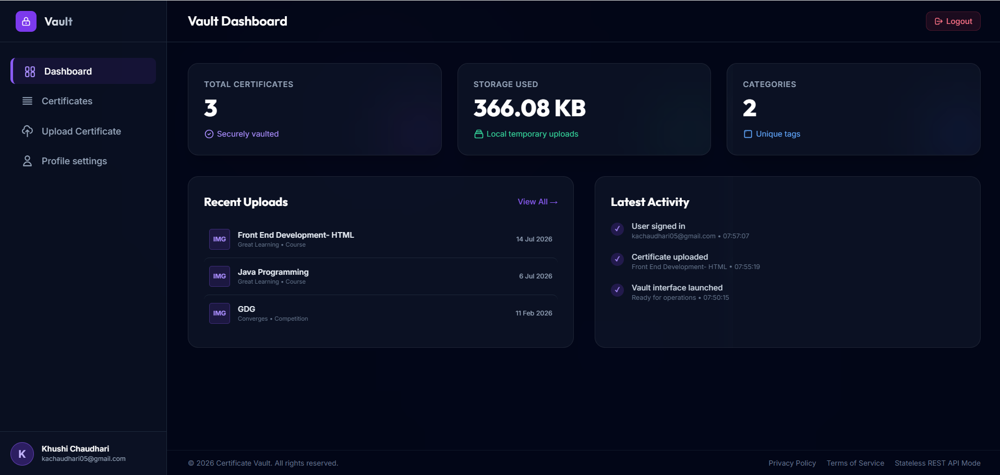

#### Login Page
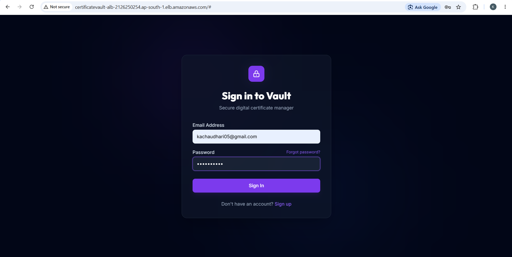

#### Upload Certificate
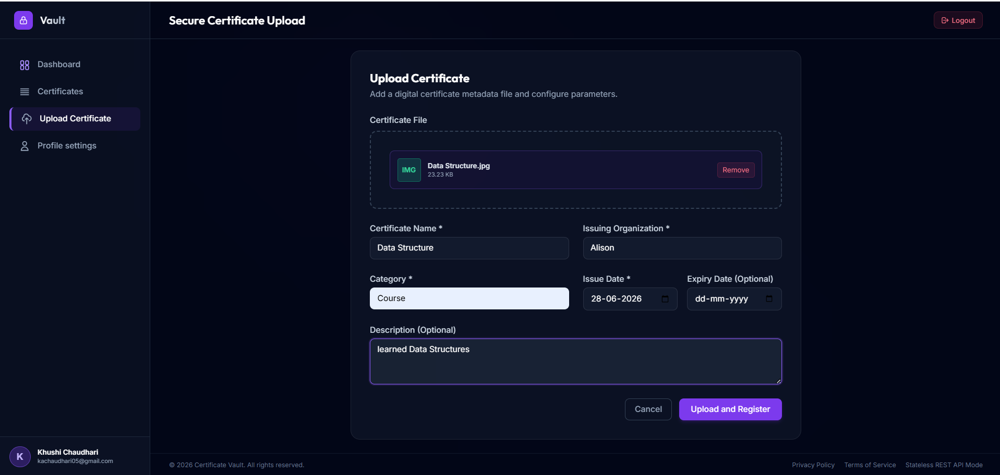

#### All Certificates
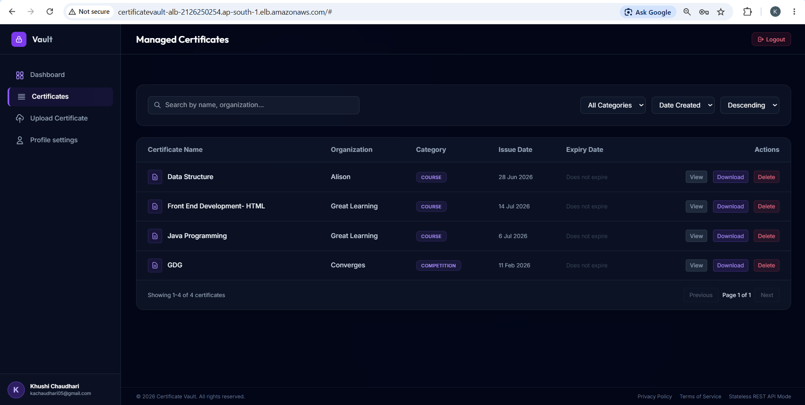

#### Profile Page
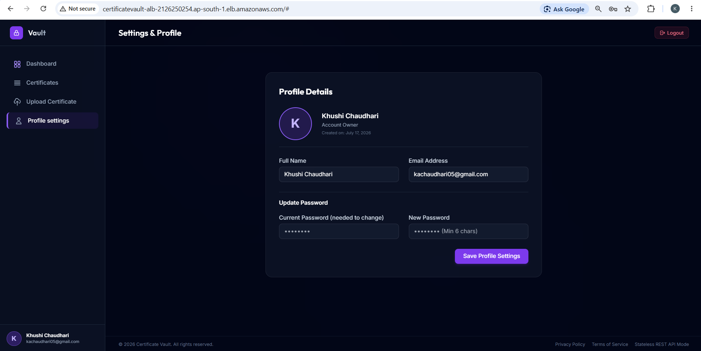


### ☁️ AWS Cloud Infrastructure

#### Amazon S3 Bucket
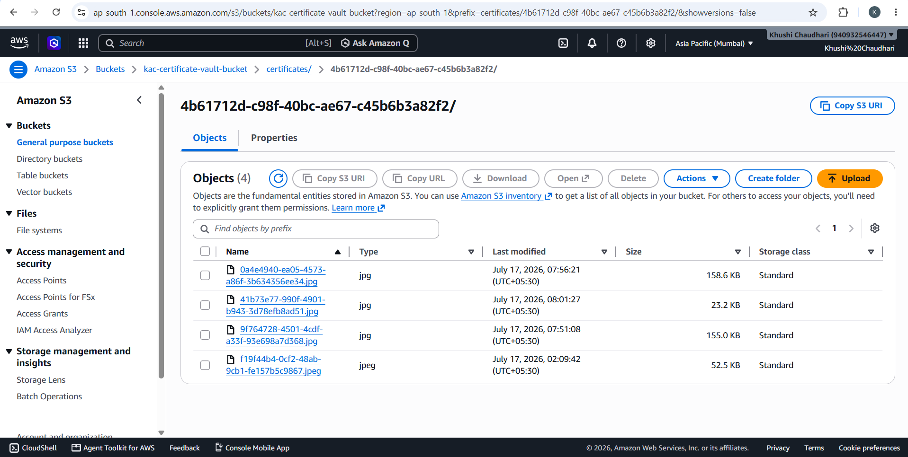

#### DynamoDB Users Table
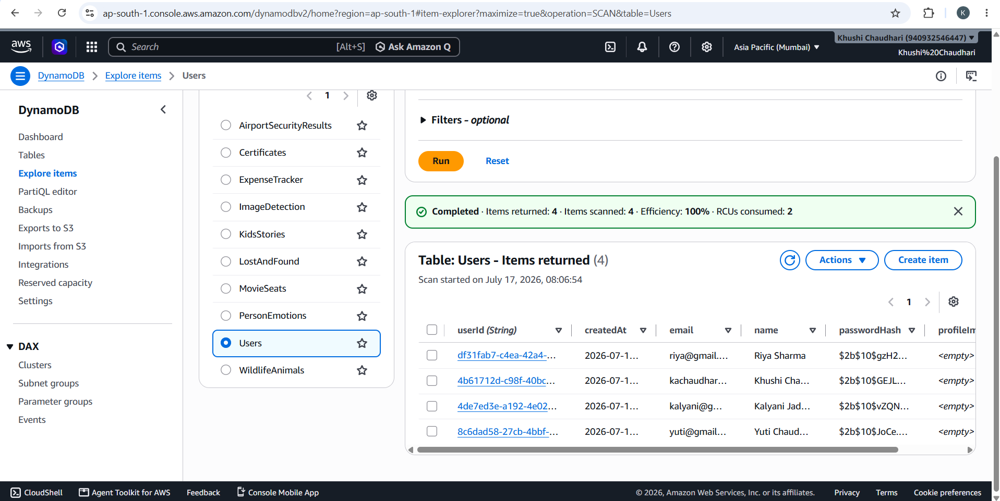

#### DynamoDB Certificates Table
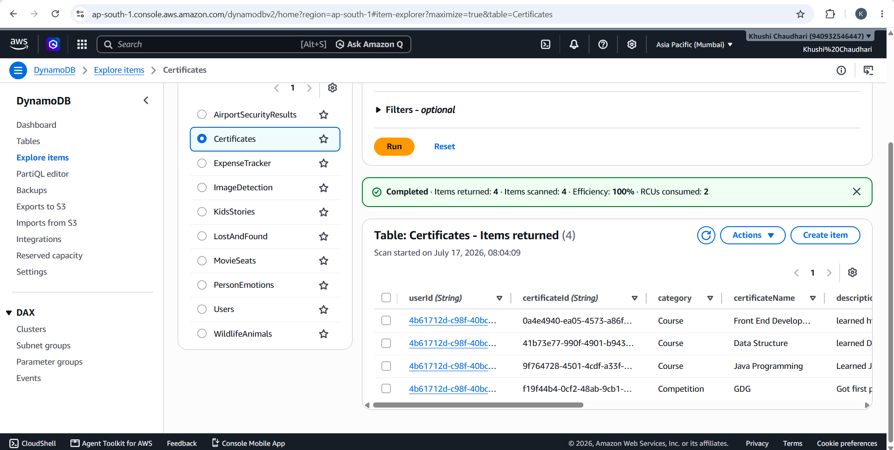

#### EC2 Instance running Application
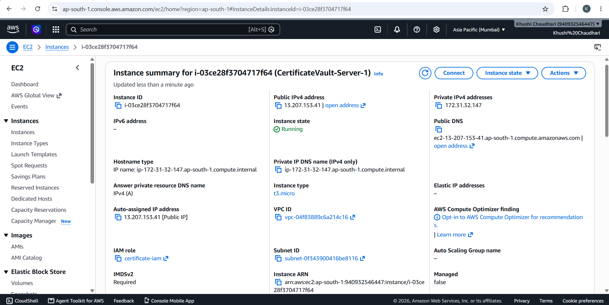

#### IAM Policies Configuration
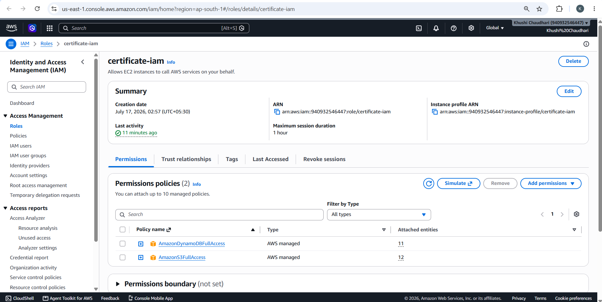

#### Custom AMI Configured
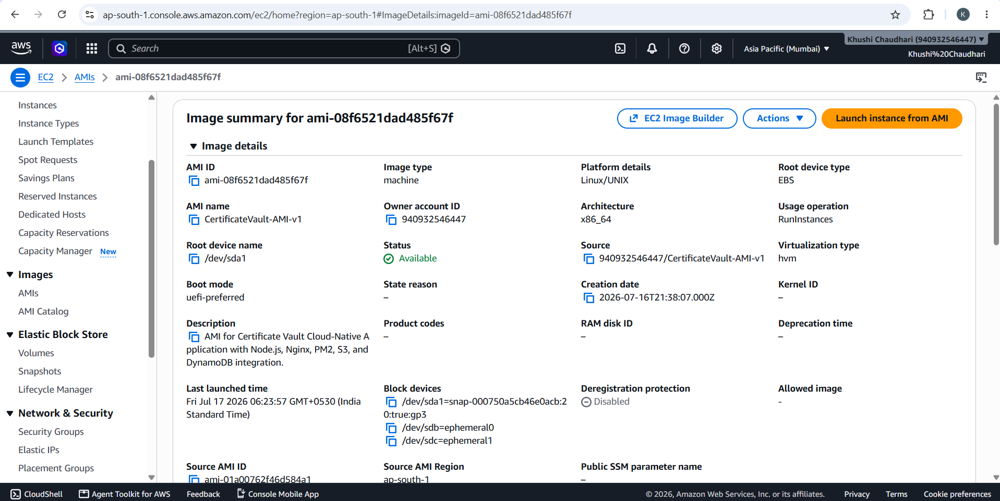

#### EC2 Launch Template
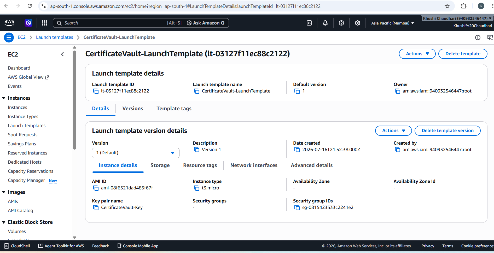

#### Application Load Balancer
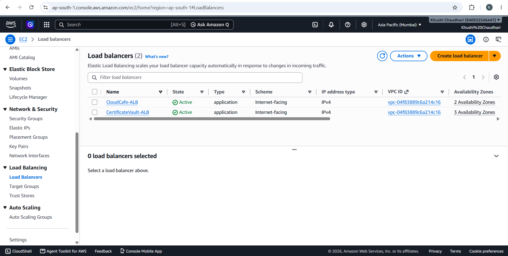

#### Auto Scaling Group Configuration
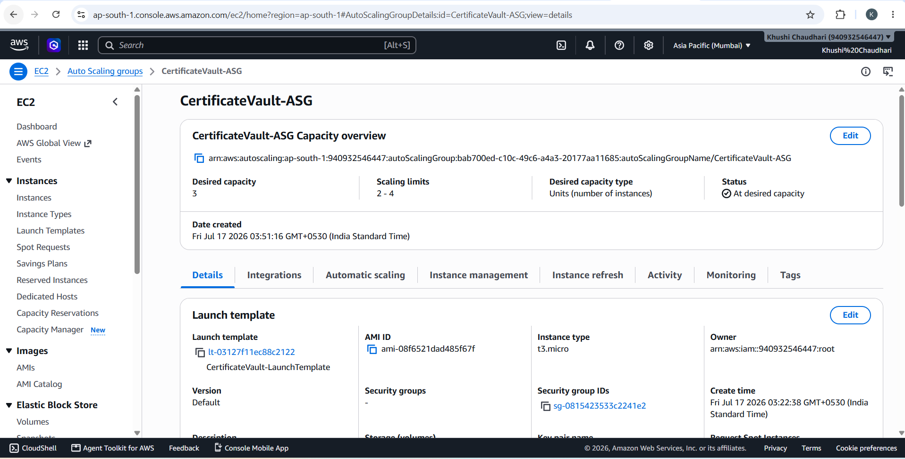

#### CloudWatch Monitoring & Metrics
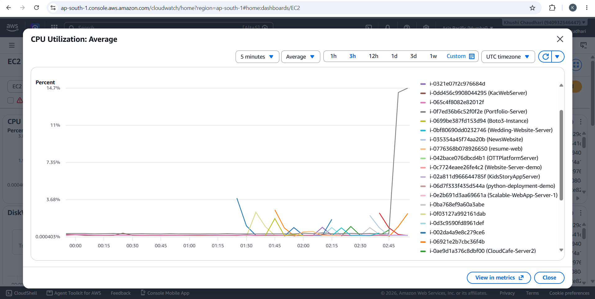

#### Server Load Testing
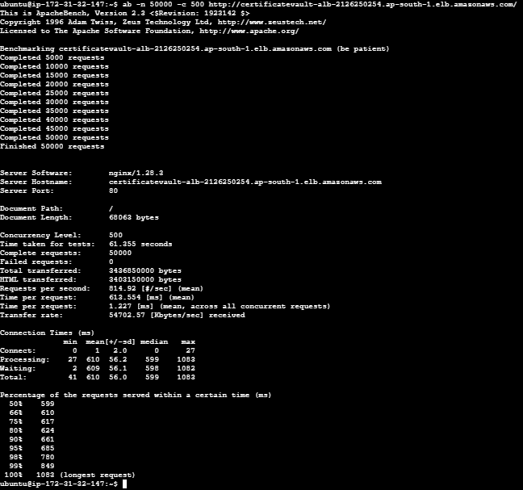

---

## 🧩 AWS Services Used

| Service | Why it is used in the Architecture |
| :--- | :--- |
| **Amazon EC2** | Hosts the backend REST API servers, running our Node.js and Express application dynamically. |
| **Amazon S3** | Provides high durability, security, and low-latency storage for uploaded certificates, keeping files out of compute instances. |
| **Amazon DynamoDB** | Fast NoSQL database that holds document metadata, enabling rapid key-value and query lookup speeds. |
| **IAM** | Protects system resources. Grants secure, permission-scoped roles to the EC2 instances to call S3 and DynamoDB without hardcoding keys. |
| **Application Load Balancer** | Distributes client requests across the Auto Scaling Group instances, handling fault tolerance and high traffic spikes. |
| **Auto Scaling Group** | Scales instances up or down based on traffic loads, maintaining application availability and cost-efficiency. |
| **CloudWatch** | Collects operational logs and metrics, helping us trigger auto-scaling policies when target boundaries are crossed. |
| **Nginx** | Acts as a high-performance web reverse proxy to secure client connections and direct traffic to PM2 application ports. |
| **PM2** | Serves as a process manager to run the Node server in the background, reload without downtime, and restart on system crashes. |

---

## 🪜 Step-by-Step Deployment Steps

### 1. Deploy to EC2
*   Launch an EC2 Instance (Ubuntu 22.04 LTS).
*   Install Git, Node.js, and npm.
*   Clone the project repository and install backend dependencies.

### 2. Configure Nginx
*   Install Nginx: `sudo apt install nginx`.
*   Configure Nginx as a reverse proxy by modifying `/etc/nginx/sites-available/default` to forward traffic to `http://localhost:5000`.
*   Restart Nginx: `sudo systemctl restart nginx`.

### 3. Configure PM2
*   Install PM2 globally: `npm install -g pm2`.
*   Start backend app: `pm2 start server.js --name "certvault"`.
*   Ensure PM2 starts on boot: `pm2 startup` and `pm2 save`.

### 4. Attach IAM Role
*   Create an IAM Role with `AmazonS3FullAccess` and `AmazonDynamoDBFullAccess` permissions.
*   Attach the IAM Role to the running EC2 instance. This eliminates the need to configure credentials via `.env` on production servers.

### 5. Create AMI
*   Stop the EC2 instance briefly and create an Amazon Machine Image (AMI) based on the configured server. This captures the OS, Nginx configs, Node.js scripts, and setups.

### 6. Create Launch Template
*   Create an EC2 Launch Template using the generated AMI.
*   Specify the target security groups, IAM instance profile role, and instance details.

### 7. Create Application Load Balancer (ALB)
*   Provision an Application Load Balancer.
*   Set up a Target Group routing traffic to HTTP port 80.
*   Attach health checks pointing to `/api/auth/profile` (or an equivalent status route).

### 8. Create Auto Scaling Group (ASG)
*   Configure the Auto Scaling Group using the Launch Template.
*   Set desired, minimum, and maximum instances (e.g., Min: 1, Desired: 2, Max: 4).
*   Attach target scaling policies based on CPU usage (e.g., target 70% CPU usage).

### 9. Perform Load Testing
*   Use load-testing tools (like Artillery or Apache Bench) to simulate high user activity.
*   Monitor CloudWatch graphs to verify that the Auto Scaling Group triggers instance scaling when target thresholds are exceeded.

---

## 🎓 Learning Outcomes

*   🧠 **Decoupled Architecture:** Understood the importance of building stateless backend services to facilitate independent horizontal scaling.
*   🛡️ **Least Privilege Access Policy:** Configured IAM roles to allow specific EC2 instances access to S3 and DynamoDB without hardcoding credentials in configuration repositories.
*   ⚖️ **Load Distribution & Fault Tolerance:** Configured Application Load Balancers and Auto Scaling Groups to distribute HTTP traffic and automatically replace unhealthy instances.
*   🚀 **Performance Monitoring:** Configured CloudWatch metrics to monitor system status, track request spikes, and trigger automated scale-out operations.
*   🔄 **Reverse Proxying:** Integrated Nginx to intercept client connections, handle routing, and direct internal requests safely.

---

## 💼 Resume Highlights

If you are an interviewer or recruiter, here are the key highlights to notice about this project:
*   **Cloud-Native Architecture:** Developed a decoupled structure separating compute (EC2), database (DynamoDB), and storage (S3) for modular robustness.
*   **Scalable Infrastructure:** Deployed under an Auto Scaling Group with Application Load Balancing, ensuring application uptime and resilience to network spikes.
*   **AWS Best Practices:** Implemented secure access patterns using IAM EC2 Instance Profiles instead of insecure hardcoded API keys.
*   **Production Deployment:** Employed Nginx as a reverse proxy, PM2 for background process management, and automated scaling thresholds.
*   **Stateless Backend:** Constructed a stateless Node.js backend using JWT authentication, allowing instances to scale out horizontally without shared state issues.
*   **Secure File Storage:** Stored all uploads in private Amazon S3 buckets with secure presigned URLs/API downloads for authorization control.

---

## 🔮 Future Enhancements

*   🔒 **HTTPS Setup:** Configure SSL certificates using Let's Encrypt or AWS Certificate Manager (ACM) to encrypt all backend endpoints.
*   ⚡ **Amazon CloudFront:** Set up a CDN caching layer in front of S3 to speed up asset delivery globally.
*   🌐 **Custom Domain:** Map a customized domain name to the Application Load Balancer using Route 53.
*   🛡️ **AWS WAF:** Add a Web Application Firewall to mitigate SQL Injection, XSS, and DDoS threats.
*   🤖 **CI/CD Pipeline:** Implement GitHub Actions to automate linting, tests, and EC2/ASG AMI rolling deployments.
*   📨 **Email Alerts:** Configure Amazon SES (Simple Email Service) to send certificate renewal notifications and registration greetings.
*   🗂️ **S3 Versioning:** Enable versioning on S3 to prevent accidental deletions of certifications.
*   👥 **Multi-user Roles:** Support administrative accounts, university verifier views, and normal user roles.

---

## 📄 License

This project is licensed under the MIT License - see the [LICENSE](LICENSE) file for details.
